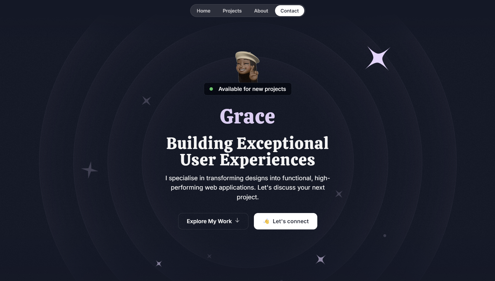

# Personal Website

This repository contains the source code for my personal website built using Next.js, Tailwind CSS, and CSS animations.

## Site Preview

[Link to live site](https://www.figma.com/community/file/1297484254996536416/personalfolio-portfolio-template)


## Features
- **Next.js** for server-side rendering and routing.
- **Tailwind CSS** for utility-first styling.
- **CSS animations** for smooth and interactive transitions.
- Fully responsive design for all screen sizes.

## Getting Started

### Prerequisites
Make sure you have the following installed on your system:
- Node.js (>= 14.x)
- npm (>= 6.x) or yarn (>= 1.x)

### Installation
1. Clone the repository:
   ```bash
   git clone https://github.com/your-username/personal-website.git
   ```
2. Navigate to the project directory:
   ```bash
   cd personal-website
   ```
3. Install the dependencies:
   ```bash
   npm install
   # or
   yarn install
   ```

### Running the Development Server
Start the development server:
```bash
npm run dev
# or
yarn dev
```

Open [http://localhost:3000](http://localhost:3000) in your browser to see the website.

### Building for Production
To build the project for production:
```bash
npm run build
# or
yarn build
```

Run the production build locally:
```bash
npm start
# or
yarn start
```

### Deploying
You can deploy this project using platforms like Vercel, Netlify, or any other static site hosting services. To deploy on Vercel:
1. Install the Vercel CLI:
   ```bash
   npm install -g vercel
   ```
2. Deploy the project:
   ```bash
   vercel
   ```

## Project Structure
```
.
├── public           # Static assets (images, icons, etc.)
├── src
│   ├── components    # Reusable React components
│   ├── sections      # Next.js page sections
│   └── assets        # Icons and Images
├── tailwind.config.js  # Tailwind CSS configuration
├── next.config.js      # Next.js configuration
└── package.json        # Project dependencies and scripts
```

## Customization
- Modify `tailwind.config.js` to adjust theme settings.
- Update `src/pages/index.js` to customize the homepage content.
- Use `src/components` for adding or editing reusable UI elements.

## Contributing
Feel free to fork this repository, make changes, and submit a pull request.

## Licenseand Attribution
This project is licensed under the MIT License. See the [LICENSE](LICENSE) file for details.
Feel free to reach out if you have any questions or suggestions!

This portfolio project was heavily inspired by the wonderful portfolio design [located here](https://www.figma.com/community/file/1297484254996536416/personalfolio-portfolio-template).

This may be used for personal projects but commercial use is prohibited.

Happy coding, and enjoy building your new portfolio!
